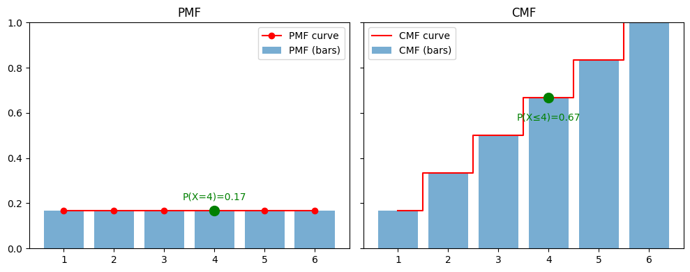

# Analysis of Probability Mass Function (PMF) and Cumulative Distribution Function (CDF) for a Fair Six-Sided Die

## Introduction

</img>

The attached image illustrates the Probability Mass Function (PMF) and Cumulative Distribution Function (CDF) for rolling a fair six-sided die, where each outcome (x ∈ {1, 2, 3, 4, 5, 6}) has an equal probability. This article provides a detailed explanation of these concepts, their real-world implementation, effects of their absence, and a comparison to enhance understanding for individuals with limited technical knowledge.

## Section 1: Probability Mass Function (PMF)
### Definition and Usage
The PMF, depicted on the left side of the image, represents the probability of each specific outcome. For a fair die, P(X = x) = 1/6 ≈ 0.17 for each x. The bars in the PMF graph are of equal height, reflecting the fairness of the die. For instance, at x = 4, P(X = 4) = 0.17, indicating a 16.7% chance of rolling a 4.

### Real-World Implementation
In statistical modeling and simulations (e.g., gaming or quality control), PMF is used to assign probabilities to discrete outcomes, ensuring accurate predictions. Software tools like Python or R implement PMF to generate random variables for testing hypotheses.

### Effects of Non-Usage
Without PMF, it becomes impossible to quantify the likelihood of individual outcomes, leading to unreliable decision-making in probabilistic systems. For example, in a game design, neglecting PMF could result in unbalanced mechanics.

## Section 2: Cumulative Distribution Function (CDF)
### Definition and Usage
The CDF, shown on the right side of the image, accumulates the probabilities up to a given value. At x = 4, F(4) = P(X ≤ 4) = 4/6 ≈ 0.67, meaning there is a 66.7% chance of rolling a number from 1 to 4. The step-like structure increases by 1/6 at each integer.

### Real-World Implementation
CDF is critical in reliability engineering and finance to assess the cumulative probability of events (e.g., failure rates or stock price thresholds). It is implemented in data analysis tools to derive percentiles and confidence intervals.

### Effects of Non-Usage
Absence of CDF hinders the evaluation of cumulative risks or probabilities, impairing strategic planning. For instance, in risk assessment, omitting CDF could lead to underestimating the likelihood of multiple failure events.

## Section 3: Area Under the Curve
### Calculation and Value
- **PMF Area**: The area under the PMF bars is the sum of the bar heights (0.17 × 6 = 1), representing the total probability, which must equal 1 for a valid probability distribution.
- **CDF Area**: The area under the CDF curve has no probabilistic meaning. It is a geometric area under the step function, calculated as the integral of the step heights. For the given CDF, this area increases with each step but does not equal 1 (e.g., at x = 6, the area is approximately 2.67, a nonsensical probability value exceeding 1).

### Interpretation and Nonsensical Value in CDF
The PMF’s area under the curve is a direct measure of total probability (1), while the CDF’s area is not. The CDF itself provides the cumulative probability (e.g., F(6) = 1), but its geometric area grows indefinitely with the number of steps, rendering it meaningless in probabilistic terms. This distinction is crucial to avoid misinterpretation in applications.

## Section 4: Comparative Analysis
The following table compares PMF and CDF based on key attributes:

| **Attribute**          | **PMF**                          | **CDF**                          |
|-------------------------|-----------------------------------|-----------------------------------|
| **Definition**          | Probability of a specific outcome | Cumulative probability up to a value |
| **Graph Shape**         | Equal-height bars                | Step function                    |
| **Example Value**       | P(X = 4) = 0.17                  | F(4) = 0.67                      |
| **Area Under Curve**    | Equals 1 (total probability)     | Nonsensical (e.g., ~2.67 at x=6) |
| **Application**         | Individual outcome analysis      | Cumulative risk assessment       |

## Conclusion
Understanding PMF and CDF is fundamental for probabilistic analysis. The PMF provides discrete outcome probabilities, while the CDF offers cumulative insights. The area under the PMF curve validates the probability distribution (sum = 1), whereas the CDF’s area is geometrically derived and lacks probabilistic significance. Proper implementation ensures accurate modeling, while their absence can lead to flawed conclusions, particularly in data-driven fields.

---